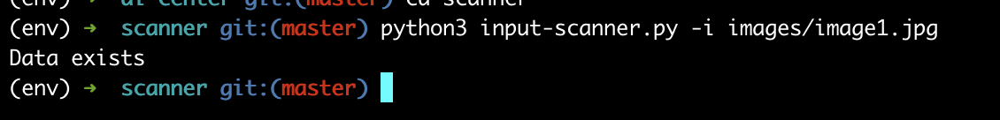
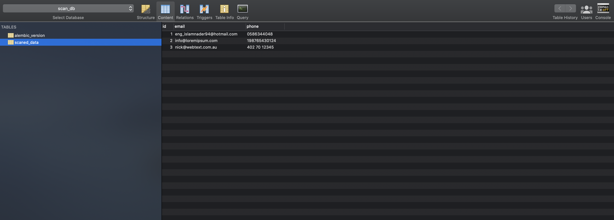
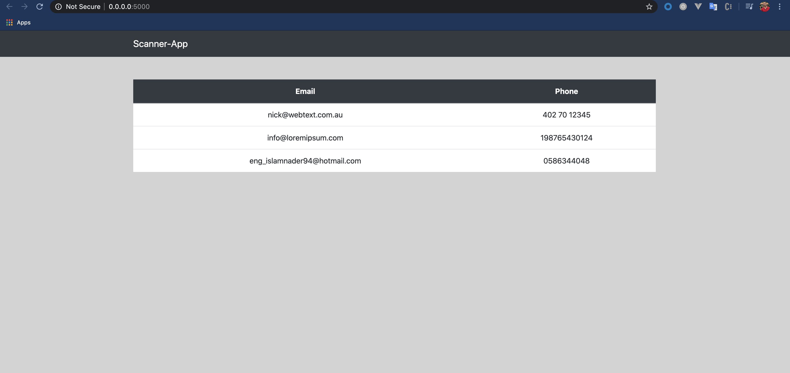
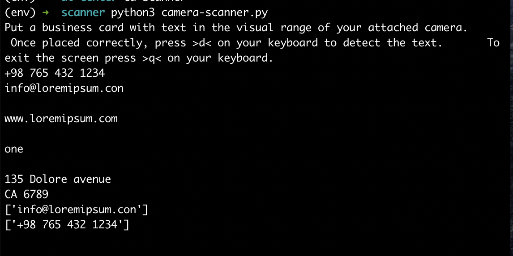

# OpenCV-Python
Business card scanner for AI-Center

## Installation

Start by installing virtual enviroment:

### Linux users:

```
sudo pip3 install virtualenv
```
### Windows users:
Prerequisites
I recommend enabling the Windows Subsystem for Linux (WSL) in order to take full advantage of all the functionality of venv on Windows 10. This allows you to run a full Linux distribution within Windows to aid in the functionality of the new dev environment.

Go to Start > then search for “Turn Windows features on or off.”
Click the link to open the Windows control panel. 
Next, open the Windows features pop-up menu. 
Scroll down in that list to locate the “Windows Subsystem for Linux” option and select the checkbox.
Reboot.

## Activate the virtual enviroment:

### Linux users:

```
source env/bin/activate
```
### Windows users:

```
env\Scripts\activate
```

### Install the requirments:

```
sudo pip3 install -r requirements.txt
brew install mysql
```

### Create the database using terminal, copy the following commands to get you started with running the app:

```
mysql -u root -p

mysql> CREATE USER 'flask_user'@'localhost' IDENTIFIED BY '1234';

mysql> GRANT ALL PRIVILEGES ON *.* TO 'flask_user'@'localhost';

mysql> CREATE DATABASE scan_db;
```

### Run database migrations to reflect changes to you database "scan_db":

```
python3 migrate.py db init
python3 migrate.py db migrate
python3 migrate.py db upgrade
```

### Run the server:

```
cd server

python3 main.py
```

## To run the input scanner, make sure the server is kept running, then use the bellow command followed by the arguments of the image path:

## windows users, follow the link provided https://github.com/tesseract-ocr/tesseract and add the line bellow to input-scanner.py file, then follow the same steps of linux users:

```
tess.pytesseract.tesseract_cmd = r"C:<path-to-your-exe-file>\Tesseract-OCR\tesseract.exe"
```

### linux users:

```
cd scanner

python3 input-scanner.py --i images/image1.jpg
```


### To run the camera scanner, make sure the server is kept running, then use the bellow command followed by the arguments of the image path, *Note: camera scanner is not accurate, sometimes it showes results and sometimes it doesn't!:

```
cd scanner

python3 camera-scanner.py
```

### Screenshots for the project in action:




